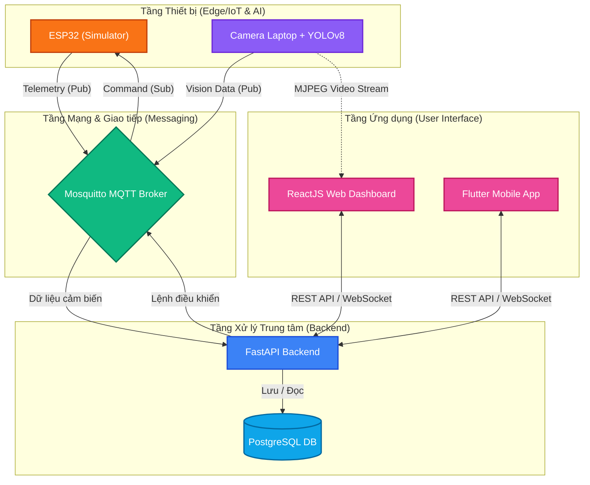

# SMART CLASSROOM AIoT 🎓

Chào mừng các bạn sinh viên đến với dự án **Hệ thống phòng học thông minh (Smart Classroom AIoT)**. Đây là một dự án hoàn chỉnh End-to-End kết hợp giữa Internet of Things (IoT), Trí tuệ nhân tạo (AI/Computer Vision) và Web Development.

---

## 🏛️ Sơ đồ Kiến trúc Hệ thống (System Architecture)



---

## 📁 Cấu trúc thư mục dự án

* `ai-camera-service/`: Service xử lý ảnh bằng YOLOv8n (FastAPI + OpenCV). Đếm người realtime và stream video.
* `backend/`: REST API Core (FastAPI), xử lý nghiệp vụ, giao tiếp DB (SQLAlchemy) và MQTT Broker (Paho).
* `device-simulator/`: Script giả lập thiết bị ESP32 bằng Python để sinh dữ liệu Nhiệt độ, Độ ẩm.
* `infrastructure/`: Chứa file `docker-compose.yml` để khởi chạy PostgreSQL và Mosquitto MQTT nhanh chóng.
* `web-dashboard/`: Giao diện quản trị hiện đại viết bằng ReactJS (Vite) + Material UI + Recharts.
* `mobile-app/`: (Cấu trúc mẫu) Source code Flutter dùng cho việc phát triển App trên điện thoại.
* `docs/`: Chứa các tài liệu hướng dẫn nâng cao (ví dụ: Tích hợp ESP32 phần cứng thật).

---

## 🚀 Hướng dẫn cài đặt và Chạy dự án (Dành cho Sinh viên)

### 1. Khởi động Database & MQTT Broker
Yêu cầu: Máy tính cần cài đặt **Docker Desktop**.
```bash
cd infrastructure
docker-compose up -d
```
*(PostgreSQL chạy ở port 5432, Mosquitto MQTT chạy ở port 1883)*

### 2. Chạy Backend (FastAPI)
Yêu cầu: Đã cài đặt **Python (>=3.9)**.
```bash
cd backend
# Tạo và kích hoạt môi trường ảo (Virtual Env)
python -m venv venv
.\venv\Scripts\activate      # (Dành cho Windows)
# source venv/bin/activate   # (Dành cho Mac/Linux)

# Cài đặt thư viện
pip install -r requirements.txt

# Khởi tạo dữ liệu mẫu (Tạo Admin, Phòng học, Thiết bị mẫu)
python seed.py

# Khởi động Backend
python -m uvicorn app.main:app --reload --port 8000
```

### 3. Chạy Thiết bị giả lập (Simulator)
Mở một Terminal mới (hoặc CMD/PowerShell):
```bash
cd device-simulator
python -m venv venv
.\venv\Scripts\activate
pip install -r requirements.txt

# Chạy Simulator
python src\main.py
```

### 4. Chạy AI Camera (YOLOv8)
Mở một Terminal mới:
```bash
cd ai-camera-service
python -m venv venv
.\venv\Scripts\activate
pip install -r requirements.txt

# Chạy Camera Service
python -m uvicorn app.main:app --reload --port 8001
```

### 5. Chạy Web Dashboard
Yêu cầu: Đã cài đặt **NodeJS (>=18)**.
```bash
cd web-dashboard
npm install
npm run dev
```
Mở trình duyệt tại địa chỉ: `http://localhost:5174` (hoặc cổng mà Terminal báo).
* **Tài khoản mặc định:** `admin@smartclass.local`
* **Mật khẩu:** `Admin@123`

---

## 💡 Kịch bản Trải nghiệm (Demo)

1. Đăng nhập vào Web Dashboard.
2. Vào trang **Tổng quan**, bạn sẽ thấy nhiệt độ, độ ẩm được Simulator gửi lên cứ mỗi 5 giây. Biểu đồ sẽ chạy Realtime.
3. Vào trang **Điều khiển**, thử bật/tắt Quạt và Đèn. Bạn hãy nhìn vào Terminal của tab `device-simulator` để thấy thông báo lệnh điều khiển đã được nhận thành công qua giao thức MQTT.
4. Ấn nút "Bật High Temp" (Giả lập nhiệt độ tăng đột ngột lên > 32 độ).
5. Bật Camera và ngồi trước webcam. Hệ thống sẽ phát sinh **Cảnh báo Nhiệt độ cao** (Do Rule Engine: Nếu có người + Nhiệt độ cao -> Cảnh báo).
6. Sang trang **Cảnh báo** để theo dõi và bấm "Xác nhận" để xử lý sự cố.

Chúc các bạn thành công! 🎓🚀
